# Introdução

O transporte universitário, é um tipo de transporte que tem por objetivo, oferecer ao estudante uma forma  segura para ir e voltar da Universidade. Atualmente, existem diversos motoristas, ou proprietários de vans, bem  como empresas do ramo de transporte universitário, assim como vários estudantes à procura desse serviço.

# Problema

A condução do estudo de campo conduzido pela equipe **Van GO!**, resultou em um levantamento objetivo daquilo que já era previsto. Percebemos um numero significativo de motoristas universitarios disponiveis, atuantes em diferentes regiões e universidades, porém, existe uma deficiencia por parte dos motoristas no sentido da divulgação de seu serviço, deficiencia essa, que implica na dificuldade por parte do estudante universitário, 
em encontrar informações detalhadas, sobre os transportes de forma fácil e organizada. 
Isso traz consequências diretas no transporte, algumas vans não têm sua capacidade total de assentos ocupados, e os universitários, nem sempre estão conseguindo encontrar o transporte adequado para o seu trajeto e orçamento e/ou da sua necessidade de flexibilização de contrato, exemplo: Somente a ida, somente a volta, etc. 
Pelo motivo levantado, foi definido priorizar o problema da deficiência de informações referente a transportes escolares universitários.

## Design Thinking 

Durante o levantamento do entendimento do problema no _Design Thinking_, a equipe trabalhou baseado nas
discussões levantadas durante as aulas iniciais.
Como parte do entendimento do problema, utilizamos de conversas informais com motoristas e universitários, 
com o objetivo de compreender como funciona o transporte universitário. A partir do entendimento, foi feito, 
um mapa representando os _stakeholders_:

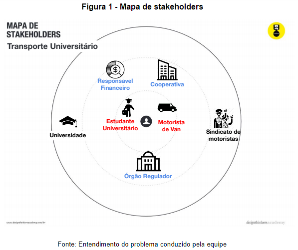

O mapa de _stakeholders_, principalmente mostra que não existe apenas estudante e 
motorista como parte do processo, são esses fundamentais, porém, existe ainda 
partes interessadas no processo que influenciam nesse meio. 

No aro de _stakeholders_ principais, estão o estudante universitário, e o motorista universitário, 
estes são o público alvo. No aro de _stakeholders_ diretos, estão o responsável financeiro, que pode 
ser o próprio estudante, ou mesmo seu parente como mãe, pai, ou outra pessoa que assuma com o custo 
financeiro do transporte, sendo esse stakeholder um influenciador direto no processo. A cooperativa 
listada também como um influenciador direto, pode existir ou não para cada motorista, uma cooperativa 
é uma organização que reúne diversos outros motoristas. O órgão regulador 
(Exemplo: DETRAN, BHTrans, etc), é um stakeholder direto e regulador do processo, 
ele define regras de funcionamento, padrões e normas.

Como parte do processo de alinhamento do problema, foi definida ainda uma matriz de alinhamento no padrão CSD, contendo dúvidas, certezas e suposições levantadas pela equipe: 

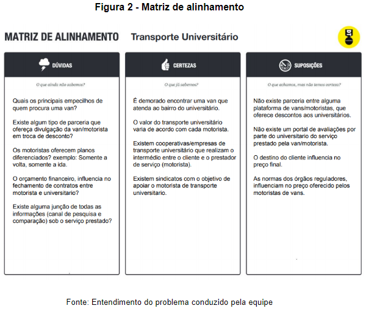

A matriz de alinhamento, se mostrou fundamental no andamento do projeto, através dela foi 
possível a equipe idealizar e projetar um questionário através do Google Forms, com o objetivo de 
conhecer as partes envolvidas. Além disso, as suposições levantadas servirão como base de 
conversas informais com as partes, através do alinhamento do problema foi possível levantar, 
histórias de usuário, personas e requisitos.

# Objetivos

A partir do problema exposto, a proposta do projeto consiste no desenvolvimento de uma plataforma _web_, denominada **“Van GO!”**, que possui como intuito facilitar a procura e divulgação de vans universitárias, fornecendo segurança por parte do motorista e estudante, possibilitando a diminuição da burocracia do processo, e principalmente firmando a transparência entre as partes. 
- O software a ser desenvolvido consistirá em aplicação web onde será possível:
  - Por parte dos motoristas de transporte, a divulgação de seus itinerários, valores, horários e mais informações que possam contribuir para a escolha como fotos de seu veículo, recursos extras, possibilidade de flexibilização;
  - Por parte dos universitários, a visualização dos prestadores de serviço disponíveis — além da possibilidade de criação de filtros para facilitar a triagem dos serviços;
  - Por parte dos universitários, a avaliação do serviço prestado por determinado motorista, estabelecendo uma pontuação para o mesmo;
  - Por parte dos motoristas, a edição dos dados cadastrados previamente, atualizando seu perfil.

# Justificativa

A motivação inicial para a proposta do projeto surgiu de um problema real, vivido por integrantes e amigos do grupo, da falta de disseminação de informações relacionadas ao transporte universitário, como rotas que são feitas, bairros que são atendidos, cooperativas envolvidas, orçamento financeiro, lotação etc. 
Ao conhecer o perfil do estudante universitário e do motorista de van, descobrimos que, além das suposições levantadas inicialmente, existem diversos outros fatores por trás de um serviço relativamente simples, que é o transporte do estudante à faculdade. Foi levantado, por exemplo, que o orçamento financeiro se baseia na distância a ser percorrida pelo (s) veículo (s), o número de estudantes para o local de destino e/ou origem, bem como a capacidade de ocupantes do veículo. Desse modo, buscamos compreender tanto as necessidades do estudante, quanto às dificuldades do motorista de fechar um contrato, tornando-se relevante o desenvolvimento de uma plataforma que possa ajudar ambos os lados a se conectarem.

# Público-Alvo

O público alvo inclui todos aqueles envolvidos na contratação de um serviço de van universitária e que enfrentam problemas para tal, sendo esses os alunos que não encontram um serviço com viabilidade de horários e financeira, e aqueles que oferecem tal serviço (motoristas, donos de vans e cooperativas) mas encontram dificuldades para divulgá-lo.

## Pesquisas 

Como parte da metodologia de trabalho adotada, seguindo a linha do estudo de campo, resolveu-se adotar o uso de questionários online, com a ferramenta do Google Forms, com o objetivo de conhecer, analisar e levantar ideias a partir do conhecimento adquirido. As pesquisas adotadas, tem o objetivo do reconhecimento do público-alvo.
> - **O universitario:** O universitário é parte importante na sociedade, ele é o futuro do país, será o profissional do amanhã, a jornada dele, do seu desenvolvimento pessoal, passa por diversos momentos, e os detalhes e como as coisas acontecem são fundamentais na vida do universitário. No contexto do universitário, foi desenvolvido um questionário, com algumas perguntas para formar um perfil do universitário.
	O questionário foi composto por 10 perguntas objetivas, e uma pergunta aberta opcional, caso o estudante queira compartilhar alguma experiência ou relato.
	Foi obtido, um número significativo de respostas dos universitários, de universidades diferentes, sendo 11 universitários da PUC-MG Praça da Liberdade, 05 da PUC-MG Barreiro, 03 da PUC-MG São Gabriel, 01 PUC-MG Coração Eucarístico, 05 do CEFET-MG,  01 da Estácio de Sá, 01 da FKMG, 01 da Faminas, 01 da Una, e 02 da UniBH.
>
> - **O motorista:** O motorista do transporte universitário, é parte importante na sociedade, através dele, diversos estudantes conseguem ter acesso a chegar a faculdade, e também em sua volta para casa com segurança. No contexto do motorista universitário, foi desenvolvido um questionário, com o objetivo de mapear o perfil do motorista universitário. 
> O questionário foi composto de 09 perguntas, e teve a participação do número de 04 motoristas, sendo que todos eles com mais de 05 anos de trabalho na área.
As áreas de trajeto atendidas pelos motoristas participantes foram: Ribeirão das Neves x BHTE, Região Leste, Centro bairros, Coração Eucarístico, Castelo, Ouro Preto, Alípio de Melo. Glória, São Salvador, Coqueiros, Pindorama. 

Foi obtido uma percentagem dos entrevistados, que já procuraram ou não uma van universitária:

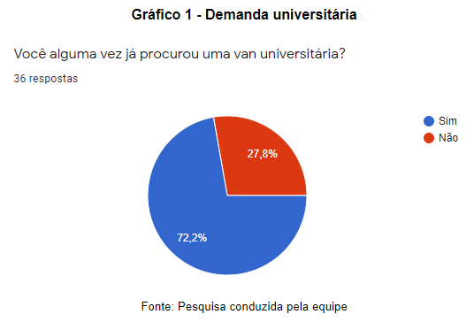

> O resultado acima ilustra o cenário de que, dentro do ambiente universitário, há muita demanda do serviço 
> de transporte, 72,2% dos entrevistados disseram que já procuraram uma van universitária. O cenário de demanda 
> por van universitária, já era esperado, tendo em vista que a maioria das universidades (Neste caso, em Belo 
> Horizonte), estão localizadas nas áreas comerciais, por exemplo: Barreiro, Centro, Savassi, Coração 
> Eucarístico, etc. Essas áreas estão relativamente distantes das áreas residenciais, e mais distante ainda das 
> pessoas que residem na região metropolitana da cidade.

A forma como os estudantes buscam informações sobre transporte universitário, se mostrou bastante variada, porém a principal forma se deu pela indicação de amigos:

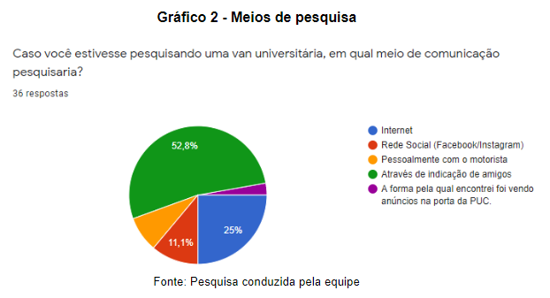

> O gráfico mostra que, a opinião de outras pessoas que já usam/usaram determinado serviço é 
> importante na decisão de grande parte dos universitários. Esse ponto mostra que um feedback com 
> sistema de avaliação com pontuação, é de grande auxílio na tomada de decisão do universitário.

A pesquisa mostrou que a maioria dos universitários não tem conhecimento de alguma plataforma de pesquisa e comparação do serviço de vans universitárias:

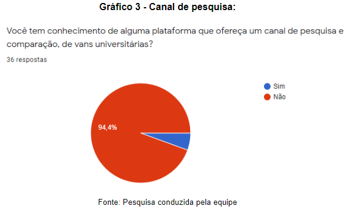

> O resultado mostra que, a grande maioria dos entrevistados não tem conhecimento de algum canal 
> de pesquisa e comparação de vans universitárias, isso mostra como a disseminação da informação 
> desse tipo de serviço é fraca.

O meio no qual os universitários usam para se locomover até a faculdade, se mostrou variado, porém, a maioria dos universitários utilizam do ônibus.

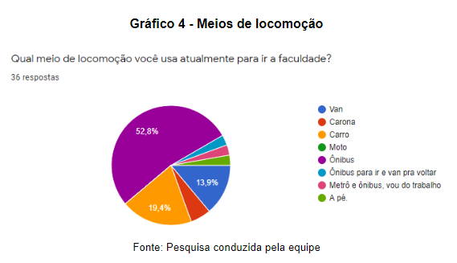

> Apenas 13,9% dos participantes utilizam a van como principal meio de transporte, isso mostra que, 
> se 72,2% dos participantes informaram que já procuraram alguma vez uma van universitária, 
> apenas alguns desses que procuraram, realmente conseguiram encontrar a sua van.

O cenário da distância dos universitários em relação a universidade, se mostrou variado:

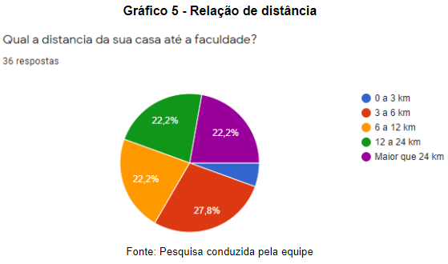

> O gráfico mostra que o número de pessoas que residem perto da universidade é muito pequeno, 
> mostrando que a grande maioria dos universitários, provavelmente vão precisar ou tem o desejo 
> de fazer uso do transporte universitário.

Sobre a relevância na opinião dos participantes, de uma plataforma no contexto do transporte universitário, foi obtido a seguinte resposta:

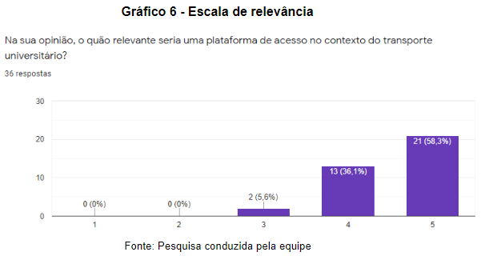

> A escala desenvolvida de 1 a 5, onde 1 não é relevante, e 5 é relevante. Mais da metade dos 
> participantes informaram a relevância de tal plataforma no contexto desenvolvido.

Sobre a captação de clientes por parte dos motoristas, foi obtido o seguinte resultado:

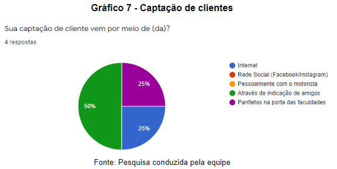 

> O resultado mostra que a principal forma de captação de clientes dos motoristas, 
> não são um padrão seguido por todos, se mostrando bastante variada com cada motorista.

Entre os participantes, apenas 1 deles, informou que todos os seus assentos estão ocupados, porém este apenas na volta.

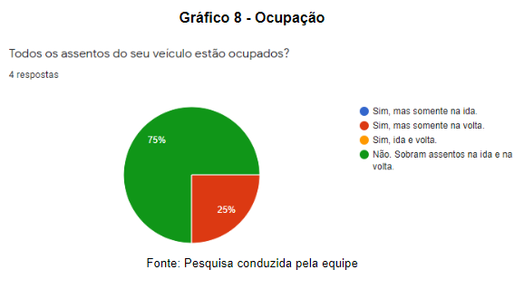 

> O resultado mostra que, apesar de haver meios de captação de cliente, e universidades 
> variadas para tal, sobram vagas no veículo, mesmo com universitários procurando por uma.
> Todos os motoristas em uma escala de 1 a 5, onde 1 mostra uma captação ruim de clientes, 
> e 5 uma ótima captação de clientes, relataram conceito 3, sendo esse mediano em relação a 
> captação de clientes. 

As dificuldades relatadas pelos motoristas na captação de clientes foram:

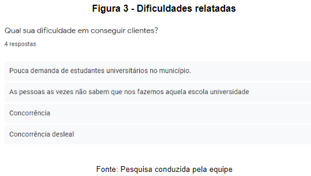 

> O resultado mostra falta disseminação da informação, falta de acessibilidade de divulgação 
> de serviço, devido ao fato de que motoristas pequenos, ou individuais, não associados a 
> cooperativas, têm dificuldade em divulgar o seu serviço.

Em uma escala de 1 a 5, todos os motoristas relataram relevância em uma plataforma para que possam divulgar o seu trabalho:

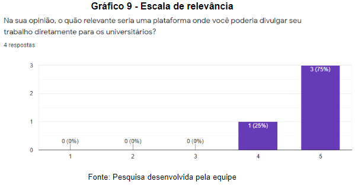 

A pesquisa causou entendimento do perfil dos envolvidos, um questionário como estudo de campo é importante, pois registra aquilo que o usuario quer relatar, a sua história, a sua experiência, com todas essas informações, é possível ter total certeza de que não é somente o universitário que tem dificuldades com transporte universitário, como motorista também.

[Próxima leitura: Especificação do projeto](/docs/2-Especificação.md)