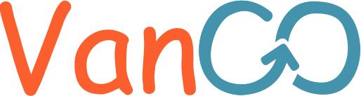

[Leitura anterior: Especificação](/docs/2-Especificação.md)

# Projeto de Interface

O projeto **Van GO!** com a sua evidencia no desenvolvimento centrado no usuario, tem como fundamento base a montagem da interface _web_, com foco não só nos requisitos funcionais, bem como nos requisitos não funcionais, como a usabilidade, a disponibilidade, etc.

A plataforma **Van GO!**  contará com dois tipos de usuários do sistema, sendo esses os universitários e os motoristas. Cada usuário realizará a interação de forma diferente, pois como bem entendido, cada um tem objetivos diferentes ao resolver fazer uso da plataforma. O objetivo do universitário é encontrar uma van e o do motorista, divulgar o seu serviço.
Com o intuito de representar a interação de cada tipo usuário com o sistema, foi desenvolvido os fluxos de usuario. As figuras a seguir representam como será feita essa interação:

## User Flow

Com o intuito de representar a interação de cada tipo usuário com o sistema, foi desenvolvido um fluxo de usuário. As figuras a seguir representam como será feita essa interação:

## Logomarca

Antes da idealização das telas da plataforma, houve a definição da logomarca que será usada em nossa plataforma, a arte feita pela integrante Erika, e que foi definida como logomarca da plataforma é:

## Wireframes

Para tornar possível o desenvolvimento do front-end, foi necessário a elaboração de wireframes, onde é possível seguir um padrão para cada paginação de site, com a criação de uma plataforma fluida e com menos erros possíveis, as telas idealizadas no projeto foram:

A tela acima mostra uma tela de introdução sobre a plataforma com um
botão onde o usuário pode ter acesso a pesquisa de transportes.

A tela, é referente a uma pesquisa de transporte, de acordo com dois
critérios o bairro, e a faculdade.

A tela acima mostra o resultado quando uma pesquisa é realizada, é
possível ainda filtrar os resultados encontrados.

A tela acima representa a tela de informações específicas sobre
determinado transporte na lista de resultados.

[Próxima leitura: Gestão da configuração](/docs/4-Gestão-Configuração.md)